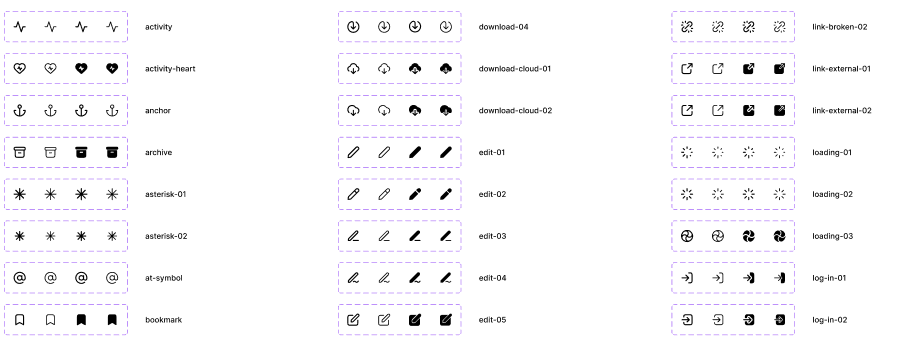

### Pro Icons

Procol Icon Pack

## How to install pro-icons in your project

1. Create a `.npmrc` file in the root of your project and add credentials

```bash
# .npmrc
@procol-tech:registry=https://npm.pkg.github.com
//npm.pkg.github.com/:_authToken=TOKEN
```

2. Create a [personal access token](https://docs.github.com/en/enterprise-server@3.4/authentication/keeping-your-account-and-data-secure/creating-a-personal-access-token) for your github account with read access to repository and packages
3. Paste your token in your `.npmrc` file.
4. Done! Now you can install the pro-icon package
   ```bash
   npm install @procol-tech/pro-icons
   ```

---
## Getting Started with Pro-Icons
Integrating Pro icons is very easy and user friendly.

1. Search the name of the Icon you want to use from this [figma library](https://www.figma.com/file/Ub8jpmLNQZ3pxTrej2du74/Fundamentals?node-id=94-247&t=wCfBIRHyNczM21YO-0).



## How to update and publish new icons

1. Setup your auth via `.npmrc` as mentioned above
2. Update source files as needed in `src/svg-icons`
3. Run `npm run build` and wait for bundles to be created
4. Run `npm publish`

### Troubleshoot

Sometimes the build process hangs after creating thr `.esm` build.
In that case, interrupt the process after the `.esm` build is created. And run `npm run postbuild` command to cleanup the build files.

Run `npm publish` after that

---

**Some utility commands for file manipulation while creating and publishing build**

```
# Rename File
# This line search for files containing `outlined` and then replaces the text `outlined` with `outline`
find . -name "*outlined*" -type f -print0 | xargs -0 -I {} sh -c 'mv "{}" "$(dirname "{}")/`echo $(basename "{}") | sed 's/outlined/outline/g'`"'
```

```
# Delete Files
# this line find all the files with which contain `mobileout` in filename and deletes them recursively
find ./ -name "*mobileout*" -exec rm -rf {} \;
```